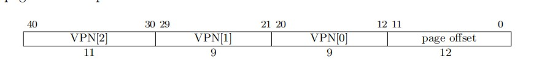

# Guest Page Table Design

## Theory
Guest 物理地址翻译和 supervisor 物理地址翻译有所不同, Guest 物理地址翻译被 `hgatp` 寄存器所控制.  
  
当 `hgatp` 为 0 时,和 supervisor 物理地址翻译相同,此时对于 guest 物理内存没有物理内存保护.  当使用 **Sv32x4**,**Sv39x4** 等等的时候, **G-stage** 地址转换通常是基于页面虚拟地址转换方案的变体.并且地址宽度被拓宽 2 位(34,41,50,59).为了填充额外的两位,根页表应当是 16 KiB 大小.为了匹配更大的大小,根页表也必须 16 KiB 对齐.  
  

上图是 Sv39 的物理地址结构,除了根页表是 16KiB 之外,其他都相同,并且 Address[63: 41] 必须是 0,否则将会发生 guest page fault.
